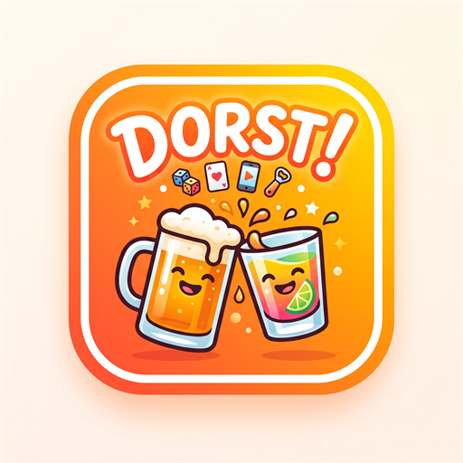

# DORST!

Drankspellen voor je hele groep, in één lobby. Iedereen opent dezelfde link op
zijn telefoon, typt de lobbycode, en de groep gaat samen door de spellen heen.
Uitgespeeld? Skip, volgende.

- 2 tot 8 spelers
- Web-app: geen installatie, geen app store
- Zwaarte instelbaar in de lobby — inclusief een **droge stand** met strafpunten
  in plaats van slokken, zodat wie rijdt gewoon mee kan doen
- Elke speler heeft een privéscherm, dus bluffen en geheime rollen kunnen echt

**Live:** https://diegosemper.github.io/rondje/

> De app heet DORST!, maar de repository en de link heten nog `rondje` — dat was
> de werknaam. Die hernoemen zou de link breken die je al gedeeld hebt, dus dat
> laten we zo tot je er klaar voor bent.

---

## Zelf draaien

Node.js en Git staan geïnstalleerd in `%LOCALAPPDATA%\rondje-tools`. Open een
PowerShell-venster in deze map en typ:

```powershell
npm run dev
```

Ga naar `http://localhost:5173`. Open dezelfde pagina in meerdere
browservensters om meerdere spelers na te doen.

**Met echte telefoons op je eigen wifi:**

```powershell
npm run telefoon
```

Daar staat een adres bij als `http://192.168.1.20:5173/`. Dat kan elke telefoon
op jouw wifi openen.

**Controleren of de code klopt:**

```powershell
npm run build
```

---

## Online zetten

Pushen naar `main` is genoeg; [`.github/workflows/deploy.yml`](.github/workflows/deploy.yml)
bouwt de app en zet hem op GitHub Pages.

```powershell
git add .
git commit -m "wat er veranderd is"
git push
```

Twee minuten later staat het online.

---

## Firebase

De lobby's lopen via Firebase Realtime Database, project `naam-rondje`. De
instellingen staan in [`src/net/firebaseConfig.ts`](src/net/firebaseConfig.ts)
en de databaseregels in [`database.rules.json`](database.rules.json).

> De Firebase-sleutel staat gewoon openbaar in deze repo. Dat hoort zo bij
> web-apps: de sleutel zegt alleen wélk project het is. De beveiliging zit in de
> regels.

---

## Hoe het in elkaar zit

| Onderdeel | Wat het doet |
|---|---|
| De app | Een website die op elke telefoon draait |
| Firebase | Een gedeeld prikbord in de cloud: alle telefoons zien dezelfde stand |
| De host-telefoon | Draait de spellogica en schrijft de uitkomst weg |

De telefoon van wie de lobby opende is de spelleider. De andere telefoons
sturen alleen "ik druk op deze knop" en krijgen het resultaat terug. Zo kunnen
twee telefoons het nooit oneens worden over wie er aan de beurt is.

```
   HOST                          Firebase                GAST
   ────                          ────────                ────
   draait de spellogica  ─schrijft─▶  spelstand  ─leest─▶  toont het scherm
   leest wat gasten doen ◀─leest───   acties     ◀schrijft─ "ik druk op HOGER"
```

### Mappen

```
public/        het logo en het app-icoontje
src/
├─ engine/     kaartdeck, beurten, slokken, stemmen, timer, toeval
├─ net/        Firebase, de lobby, de host-lus, live tekenen
├─ ui/         knoppen, speelkaarten, drinkpauze, verdeler,
│              tekenveld, arcade-veld, bierpongtafel
├─ schermen/   start, lobby, spelkiezer, uitleg, spelen, scorebord
└─ games/      één mapje per spel
```

### Een spel toevoegen

Maak een mapje in `src/games/` en voeg één regel toe aan
[`src/games/index.ts`](src/games/index.ts). Meer is het niet.

```ts
export const mijnspel: GameModule<MijnState> = {
  id: 'mijnspel',
  naam: 'Mijn Spel',
  uitleg: 'Eén zin voor op de spelkiezer.',
  regels: ['Max vier korte regels', 'want niemand leest meer dan dat'],
  minSpelers: 2,
  maxSpelers: 8,
  duur: 'kort',
  tags: ['kaarten'],
  privescherm: false,

  init(ctx)                 { /* beginstand */ },
  reduce(state, actie, ctx) { /* draait alleen op de host */ },
  View({ state, ctx })      { /* wat je op je scherm ziet */ },
  isKlaar(state)            { /* wanneer is het afgelopen */ },
}
```

Wat `ctx` je geeft in `reduce`: `drink()`, `deelUit()`, `deelUitPrecies()`,
`iedereenDrinkt()`, `zetPrive()`, `log()`, `klaar()`, plus `rng()` en
`spelers`. De zwaarte-instelling wordt automatisch verrekend — geef gewoon het
aantal door dat je bedoelt.

**Geheime informatie:** alles wat in de spelstand onder de sleutel `_geheim`
staat, blijft op de telefoon van de host en gaat nooit naar de andere
telefoons. Wat één speler wél mag zien, geef je met `ctx.zetPrive(uid, data)`;
die speler leest het terug als `ctx.prive` in de View.

**Kant-en-klaar gereedschap:** de drinkpauze (het spel staat stil tot iedereen
gedronken heeft), de verdeler (slokken spreiden over meerdere mensen),
`useHostKlok` (aftellers), `Tekenveld` (live tekenen), `maakArcadeSpel`
(behendigheidsspellen met start, score en uitslag) en `Pongveld`.

---

## De spellen

**Kaarten** — Bussen · Kingsen · Pyramide · Blinde Kaart · Ezelen ·
Kaartroulette · Fuck the Dealer · HiLo · 21 Overboord

**Geheim & bluf** — Perudo · De Imposter · Spiegelspelers · Sabotage ·
Verboden Woord · Golflengte · Twee Waarheden één Leugen · De Ketting

**Reflex & arcade** — Flappy · Jetpack · Snelweg · Stapeltoren · Bierpong ·
Snelste Vinger · Zwaartekracht · Snelle Wiskunde

**Praten & raden** — Tekenen · Raad het Nummer · Wie van Ons · Gelijk Denken ·
Het Alfabet · Bom Doorgeven · Opbouwen of Stoppen

Plus een Testspel dat elke bouwsteen los aanroept; dat staat standaard uit en
kun je in de lobby aanzetten.
